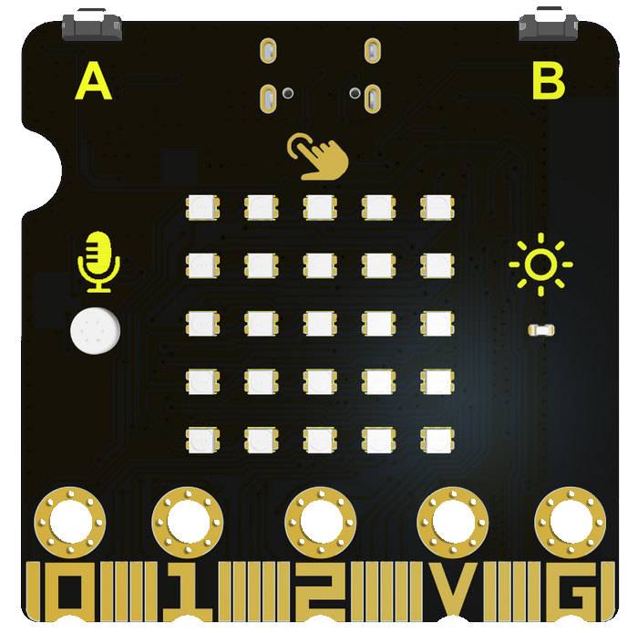
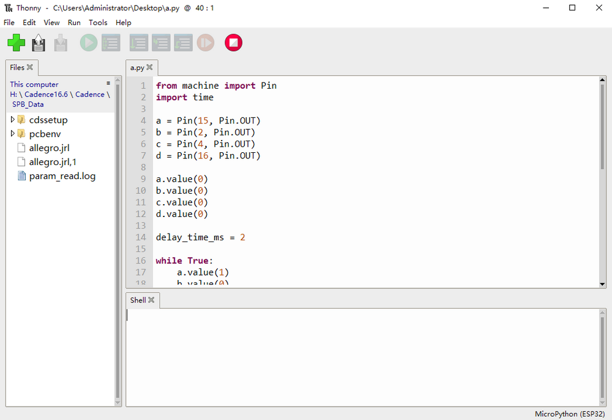
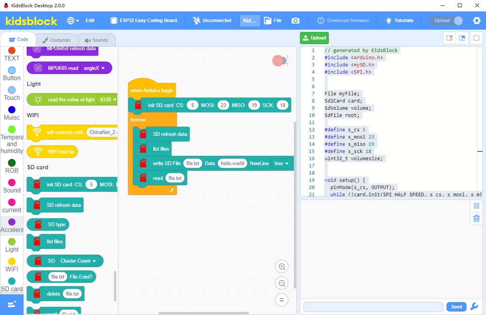

# Keyestudio ESP32 Easy Coding Board

------------------

## 1. Description

Keyestudio ESP32 Easy Coding Board is equipped with 520KB dynamic memory, 4MB flash memory and 240MHz dual-core processor to easily run a variety of real-time operating systems, like freeRTOS. Besides, its low-power Bluetooth and WiFi capabilities are excellent for wireless communication.

This board also integrates a variety of sensors on its board: The temperature and humidity sensor monitors ambient temperature and humidity in real time; The six-axis acceleration gyroscope obtains motions and acceleration; The ambient light sensor captures ambient light intensity; The SD card interface saves the detected data; The microphone detects ambient sound, and the buzzer plays music; Buttons A and B, 7 touch keys on the board can be used as switches; 5x5 RGB dot matrix displays numbers, letters and patterns with stepless dimming.

Therefore, it is widely applided to STEAM teaching, IoT, intelligent control projects, and a variety of DIY creative works.

------------

----------------

----------------

ESP32 board is welded with gold-finger expansion pins, including all IO pins, 19 digital ports, 7 analog ports, I2C, UART and SPI interfaces.

This board is compatible with a variety of programming languages, including Arduino, MicroPython and graphical programming KidsBlock3.0, and development environment of multiple boards. It is suitable for users with different programming levels.

-----------

**Compared ESP32 Easy Coding Board with Micro:bit**

|                       |                                                |                                               |
| :-------------------: | :----------------------------------------------------------: | :----------------------------------------------------------: |
|         Name          |                   ESP32 Easy Coding Board                    |                         Micro:bit V2                         |
|    Suitable crowd     |            Primary, junior high, **senior high**             |                     Primary, junior high                     |
|       Processor       |                       **ESP-WROOM-32**                       |                        nRF52833-QIAA                         |
|      Dimensions       |                           52*51mm                            |                           52*43mm                            |
|    Memory capacity    |                 **SRAM:520KB Flash:4MB**                  |                  SRAM:16KB Flash:256KB                   |
| Programming languages |             KidsBlock3.0 C/C++ microPython             |             JavaScript C/C++ microPython             |
|       I/O ports       | digital I/O pins: 19 analog input pins: 6 **PWM pins: 13** |        digital I/O pins: 19 analog input pins: 6         |
|     Communication     |   a. low-consumption Bluetooth 4.2 **b. wireless Wifi**   |                low-consumption Bluetooth 4.2                 |
|   Onboard function    | a. 2-channel button b. **7-channel touch input** c. 3-axis acceleration d. 3-axis gyroscope e. light sensor f. **5x5 RGB dot matrix** g. **temperature&humidity sensor** h. **SD card slot** i. **passive buzzer** j. **microphone** k. **Power detection** l. **I2C interface (2.54 pin headers)** | a. 2-channel button b. 3-channel touch input c. 3-axis acceleration d. 3-axis magnetometer e. light sensor f. 5x5 LED dot matrix g. temperature sensor |
|     Introductory      |                            ★★★★★                             |                            ★★★★★                             |
|    Practicability     |                            ★★★★★                             |                              ★★                              |
|     Expansibility     |                             ★★★★                             |                             ★★★                              |

---------

## 2. Technical Specifications

- Power supply: USB power; DC power(PH2.0); gold-finger I/O port power
- Operating voltage: 3.3V
- Operating current: 100mA
- ESP32 main control: 
  - Processor: ESP32-D0WDQ6 (dual-core)
  - Basic frequency: up to 240MHZ
  - SRAM:520KB
  - Flash:4MB
  - WiFi protocol: 802.11 b/g/n (802.11n, fast to 150 Mbps)
  - WiFi operating frequency range: 2412 ~ 2484 MHz
  - Bluetooth protocol: meet Bluetooth v4.2BR /EDR and BLE standards
  - Bluetooth RF: NZIF receiver with -97 dBm sensitivity
  - Bluetooth audio: CVSD and SBC audio
- Onboard resources:
  - 2-channel digital buttons (A and B buttons)
  - MPU6050 six-axis acceleration gyroscope
    - Maximum rotation speed: 2000°/s
    - Acceleration range: ±2g，±4g，±8g，±16g
  - Light sensor: phototransistor ALS-PT19-315C
  - Microphone: 4013-SMD
  - Buzzer: MLT-8530AAC3V
  - 25 RGB: WS2812-2020 RGB-LED
  - Temperature and humidity sensor: AHT20
  - SD card expansion interface
  - Power of supply detection module: INA180A1IDBVR
  - I2C expansion port (2.54 pin headers)
- Extension interface:
  - 19-channel digital I/O port (partially multiplexed with on-board resources)
  - two 8-bit DAC (io25, io26)
  - 7 touch pins (io2, io4, io12, io13, io15, io27, io32)
  - 13 PWM pins (io2, io4, io5, io12, io15, io16, io18, io19, io23, io25, io26, io27, io32)
  - 3-way UART device (any pin), support for hardware flow control and DMA
  - 2 I2C devices (any pin), support host or slave mode
  - IR remote control (any pin) 8-channel IR transceiver, support different waveform standards.

------------

## 3. Programming Methods

1. Arduino:

2. MicroPython:

3. KidsBlock3.0:

